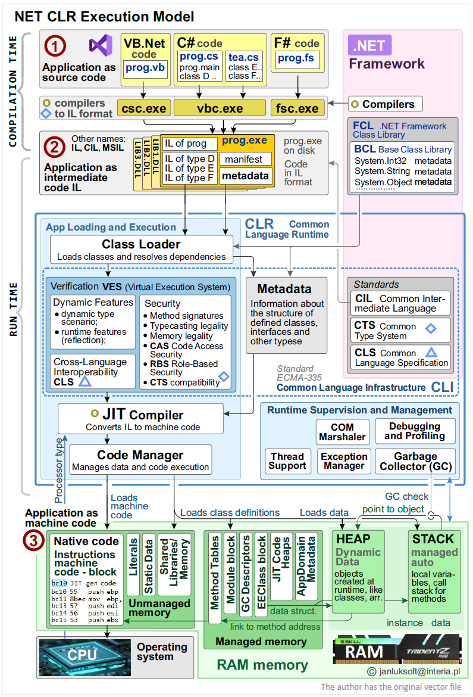
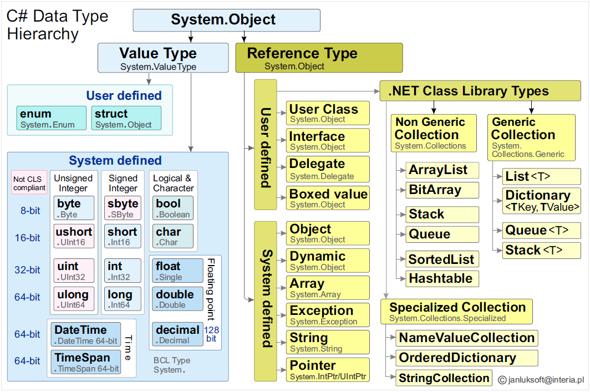
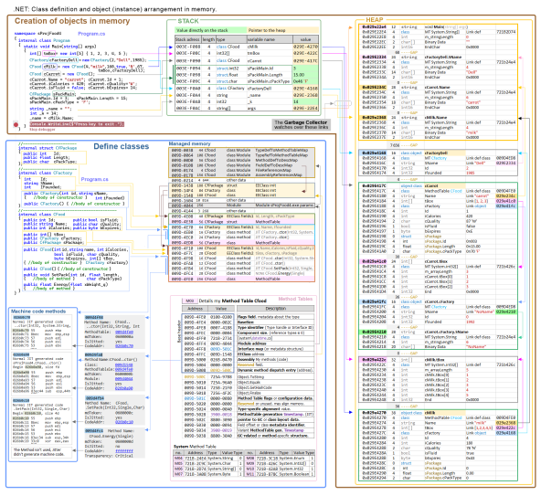

# .NET CLR execution model

## Introduction

Writing applications in low-level languages brings great opportunities
however it also carries many risks and requires a lot of time and
effort. The solution to these problems is being sought by increasingly
sophisticated development platforms that provide various mechanisms to
make writing applications easier and faster. One of the more interesting
ones is the .NET Framework platform described in this article.

The .NET Framework is a development platform by Microsoft that provides
a CLR runtime environment and a powerful FCL class library.

Below is a block diagram of the NET CLR execution model showing how the
process of building an application and running it in memory is carried
out in .NET. The rest of the article will discuss the individual stages
of this proces.




At the beginning of the article, earlier application development methods
and the troubles associated with them (such as PE format applications)
are described. Based on these, the more perfect methods and ideas
underlying the .NET framework are shown.

## Running applications in .NET - the idea

### Ways to create and run applications

It can be seen that there is a certain universal way to create and run
an application, which follows the following steps:

-   ET1) Write the application in source code form;

-   ET2) Create an application file to distribute and run on the user\'s
    system;

-   ET3) Create Machine Code for the current processor in the user
    system;

-   ET4) Place the Machine Code along with the data and control
    structure in RAM;

-   ET5) Pass data and method addresses to the operating system for
    execution;

-   ET6) Manage execution, exception handling and optimize performance;

There are different ways of doing these steps - from earlier, less
perfect ones to later ones having more advantages.

In order to appreciate what innovative ways of working with the created
application the .NET environment introduces, it is necessary to compare
the .NET platform with the former ways of creating and running
applications. A representative, former way is an application written in
the C++ standard, and to it the comparison will be made.

### Creating an application in C++ (PE format).

There are 2 stages of creating and running an application in PE format:
(Compilation time) and (Run Time)

#### Compilation time

In C++ (in short) the application goes through two states:

- (C1) Application as source code;
- (C3) Application as machine code.

The programmer who wrote \[source code\] (e.g.: cplus.cpp file) (ET1
stage) runs his commercial compiler, which from (C1 source code) creates
(C3 machine code) in the form of an .exe file (e.g.: cplus.exe) for the
selected (in compiler options) processor (e.g. x86). This is the
so-called Portable Executable (PE) format or the older name (PE/COFF).

Here the compilation performs 2 stages simultaneously: ET2 and ET3.

This file (cplus.exe) is ready to run and contains machine code only for
the x86 processor.

The user can therefore run it only on an operating system with a
physical x86 processor.

#### Run Time

In the (C3) state, a file, e.g. cpp.exe, is created.

The user has an application in the form of an .exe file (e.g.:
cplus.exe)

Running this exe application consists of running (clicking) the exe
file.

The user running the application does not need to have any knowledge of
C++ or any programming tools. The user runs the exe file from their
disk, and the operating system (e.g. Windows10) itself performs the
startup activities (PE format): ET4, ET5.

However, the operating system does not have good ET6 mechanisms - for
managing the running program.

#### Disadvantages of the PE format

The PE format has basic disadvantages:

-   WPE1) A specific exe application (e.g. cplus.exe) in another
    operating system with a different processor (e.g. ARM or A15 Bionic
    processor) does not work. Recompilation is required (by the
    application creator) and such a solution greatly limits the
    possibility of using the application;

-   WPE2) The operating system does not provide good security
    functions - ET6 management. The PE application can overwrite RAM
    memory in any place, destroying e.g. the processor stack, data
    block, code block, leading to system hang or hacker attacks.

### Processors

The above descriptions delve into the details of how computers work -
and rightly so, because the code of high-level languages ​​is ultimately
compiled to the machine code of the processor, which is the heart of the
computer\'s operation.

Therefore, basic knowledge of processors is necessary.

The most important thing is that processors only execute orders. Orders
are sequences of bytes that are located in RAM in a code block. For
example, if an x64 processor is in x86 mode and encounters the following
bytecode: {50, 83, C0, 04, BA, 02, 00, 00, 00, F7, E2, 58}, it will
execute it and interpret it as follows:

```assembly
50              push eax    ; put eax register on the stack
83 C0 04        add eax,4   ; add to eax register 4
BA 02 00 00 00  mov edx,2   ; write to edx register 2
F7 E2           mul eax,edx ; multiply eax= eax \* edx
58              pop eax     ; pop eax off the stack
```

If the same processor were switched to x64 mode, it would probably hang
the program, because in the x64 architecture there are no 32-bit eax,
edx registers, and the subsequent bytes mean something different, they
are different commands.

Even within a family of similar processors, there are differences. For
example, X86-64 processors contain extensions of single instructions,
multiple data (SIMD), such as MMX, SSE and AVX, which allow for
operations on many pieces of data using a single instruction.

All the more so for other processors, e.g. ARM (RISC), an example byte
sequence will have a completely different meaning. x86, x64 systems are
a CISC model - an extended list of instructions. ARM processors are a
list of RISC instructions reduced to a minimum.

Some high-level mechanisms themselves prepare the appropriate machine
code for the processor without the user even noticing it - what is going
on there subconsciously.

However, to know the idea, knowledge about processors is necessary.

Among the known processors, we can distinguish, for example:

- x86 (Intel) (CISC);
- x64 (Intel) (CISC);
- ARM (Mobile( (RISC);
- Power PC (Mac OS);
- M4 (Apple);
- A15 Bionic (iPhone)

**Processors - conclusion**

There are therefore different processors, different architectures, which
often differ greatly in their instruction lists. A code block must be
created exactly for this type of processor. An inappropriate code block
for another processor will certainly suspend the application or cause
damage to the operation of the operating system.

### Developing and running an application in .NET

#### Stages

Creating and launching an application in .NET is done in stages.

To overcome the problems described above in PE applications (WPE1, WPE2
) - .NET introduced the idea of launching applications in stages:

-   (C#1) Application as source code;
-   (C#2) Application as intermediate code IL;
-   (C#3) Application as machine code.

#### Compilation time

The stage from C1 to C2 is performed by the application author. He
performs the first compilation with a commercial IL compiler.

Thus, from Source Code, \[intermediate code IL\] is created - prog.exe
file on disk, in the standard of intermediate code IL.

Different parts of the application can be written in different
languages, and for each of them .NET has a separate compiler that
compiles the source code to intermediate code IL.

IL It is a universal standard not bound to any processor, which,
however, has full functionality from Source Code.

Regardless of the source language - the compiled part to IL code is from
now on compatible with any other part of IL code from other languages,
and from that point (IL code) the CLR runtime environment has its one
"input" code standard. Thus, cross-language universality is realized.

#### Data types in C# and their checking

IL compilers create IL intermediate code but also perform language and
type checking, which is performed by the CTS (Common Type System). This
is a standard that generally defines data types and describes how each
data type is represented in memory.

The next article describes this in detail. Here below is a table showing
the types and their hierarchy in the C# language




This .exe application (prog.exe) is then further distributed to users
and ultimately can be run on many different processors in the Run Time
stage.

#### Run Time

In the second stage from C2 to C3, prog.exe is launched.

Launching this program, prog.exe performs the following startup
activities: ET3, ET4, ET5, ET6.

Launching the program in .NET involves launching prog.exe from your
disk.

The user launching the program does not need to have any knowledge of
.NET or programming tools.

Both PE and .NET applications launch .exe files. However, the .NET
format file (prog.exe) has additional information and the operating
system knows that it is a .NET executable file and does not launch it
itself, but passes it on to the dedicated .NET Framework environment,
which must be installed on the system.

The .NET environment then performs the following startup activities:
ET3, ET4, ET5, ET6.

These tasks in the .NET Framework are generally performed by the CLI
(Common Language Infrastructure), and the heart of it is its most
important component: the CLR (Common Language Runtime).

ET3. Only at this stage of program execution is compilation performed by
the JIT Compiler (stage ET3). This compiler knows what processor is in
the system and creates machine code specifically for it. At the same
time, the JIT compiler can include a huge set of libraries from the FCL
or BCL, which are compatible with the IL code.

ET4. Code Manager places machine code in a code block and creates
structures thanks to which methods can be run for created instances.
Instance data is placed on the stack and heap in RAM. This is how stage
ET4 is carried out;

ET5. The operating system and CLR have all the necessary data and code
structures in RAM, so the code block using data from Stack and Heap is
run.

ET6. In parallel, when the CLR initializes the environment, it runs
separate threads of supervision and management of the executed
application: \[Runtime Supervision and Management\]. They are invisible
to the user, but they work in the background and perform ET6 tasks.

### Advantages of two-step .NET compilation:

-   The programmer performs only one universal compilation to IL;

-   When starting CLR, it creates Machine Code each time optimized for
    the processor that is in the operating system. In this way, an
    application compiled to IL a few years ago can be launched on the
    latest processors using their latest capabilities, which even the
    programmer may not have been aware of.

-   CLR watches over the correctness of input data and the correctness
    of program execution, ensuring high security.

-   Garbage Collector optimally manages memory, correcting any
    programmer errors.

## Running applications in .NET - details

Creating and launching an application in .NET follows detailed steps. At
the beginning of the article you will find an adequate flowchart and
below it a detailed description.

-   **T1) Compile time**


    -   T11) **Project with source code** (may be written in many languages)
    \[<span style="color:brown">**(1)** Application as source code</span>\]

        - T111) VB.Net code;
        - T112) C# code
        - T113) F# code

    - T12) **Compilers** (to IL format)\[Ready project are compiling\].
    Compilers checks CTS (Common Type System)

        - T111) csc.exe;
        - T111) vbc.exe;
        - T111) fsc.exe;


    -   T13) <span style="color:brown">**(2) Application as intermediate code IL**</span>. (IL compilers make exe
    files (prog.exe) on disk in CIL format (Common Intermediate
    Language). Other names: IL, CIL, MSIL.) The application contains:


        - T13A) Program code in IL format;

        - T13B) Metadata - contains informations about definitions (not
    instances):
            - T13B1) Info about types, methods, properties, fields, and assemblies;
            - T13B2) Details about: class layouts, method signatures, and type
hierarchies.


            
-   **T2) Run time**

    - T2_CLR) CLR (Common Language Runtime)

        - CLR_A) App Loading and Execution;

            - 1\) Class Loader (Loads classes and resolves dependencies)

            - 2\) Verification VES (Virtual Execution System)

               - 21\) **Security**
                 - 211\) Method signatures
                 - 212\) Typecasting legality
                 - 213\) Memory legality
                 - 214\) CAS Code Access Security
                 - 215\) RBS Role-Based Security
                 - 216\) CTS compatibility

               - 22\) **Cross-Language Interoperability** (CLS)

               - 23\) **Dynamic Features**
                 - 231\) dynamic type scenario;
                 - 232\) runtime features (reflection);

            - 3\) JIT Compiler (Converts IL to machine code)

            - 4\) Code Manager (Manages data and code execution)
                 - 41\) Loads machine code;
                 - 42\) Loads class definitions;
                 - 43\) Loads data;


    - CLR_B) Runtime Supervision and Management

      - 1\)  **Thread Support**: Manages multithreading.
      - 2\)  **Exception Manager**: Handles runtime errors.
      - 3\)  **Garbage Collector** (GC): Automatically reclaims memory.
      - 4\)  **Debugging and Profiling**: Supports performance monitoring.
      - 5\)  **COM Marshaler**: Enables interop with COM components.


 
  - **T3) RAM Memory**

      - T3A) UnManaged Memory:

        - T3A1) **Machine code**: (Instructions, compiled code, part of JIT process but read-only in
native code) \[<span style="color:brown">**(3)** Application as machine code</span>\].
        - T3A2) Literals (constants in a separate section).
        - T3A3) Static Data (global variables or class-level static fields).
        - T3A4) Shared Libraries/Memory (external resources, like DLLs).

      - T3B) Managed Memory (data specific to .NET runtime):

        - T3B1) **Module block** (*type metadata, maps like TypeDefToMethodTableMap*).

        - T3B2) **EEClass block**
        (defines fields, methods, hierarchy). EEClass is another runtime
structure that stores type-specific information, such as method metadata
and field descriptions. The MethodTable references this for detailed
type data.

        - T3B3) **MethodTable**
        (method pointers, type identity, layout). Runtime data structures
created by the CLR in memory when a type is loaded. They store
information about: a) The type\'s methods (e.g., addresses for
JIT-compiled code), b) Its vtable for virtual methods (if any), c)
Type-specific flags (e.g., whether it\'s a value type or reference
type).

        - T3B4) **JIT Code Heaps**
        holds compiled machine code for managed methods) The CLR allocates
dedicated JIT code heaps for storing compiled methods (D1). These
are separate from the heap or stack.

        - T3B5) **GC Descriptors**
        (tracks object references for garbage collection).

        - T3B6) **AppDomain Metadata** (assemblies, modules, etc.).

    - T3C) **Heap** (dynamic objects and their data, managed by GC):
      - T3C1) Dynamic Data Heap (objects created at runtime, like classes,
arrays, etc.).

    - T3D) **Stack** (local variables, call stack for methods):
        - T3D1) Stack (managed automatically for local variables).


## RAM Usage Analysis for C# Applications

The following article presents a very detailed RAM dump of a running C#
application. It declares several classes, variables, structures, arrays
and you can see in great detail how the CLR distributed these blocks in
RAM.




## This chapter is part of the main project

This chapter is part of the <a href="https://github.com/janluksoft/NET_MainComparison">NET Main Comparison project</a>:<br> 
"Comparison of software development methods from low-level methods to .NET".

The next chapter is:
<a href="https://github.com/janluksoft/NET_CLR_RAM">Example of .NET application components placement in RAM via CLR</a>